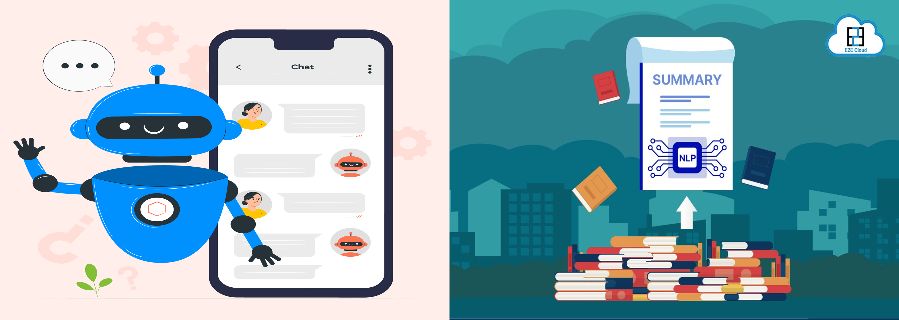
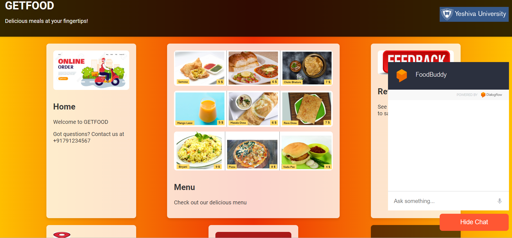
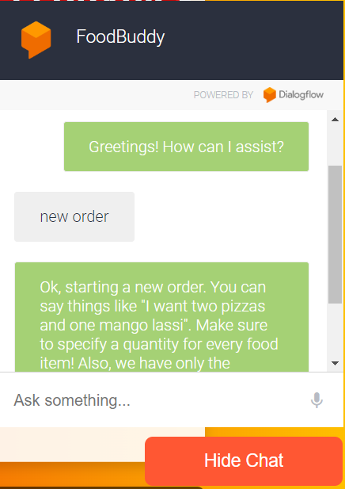
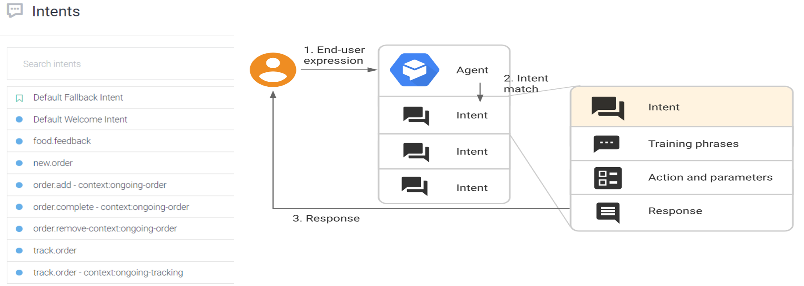
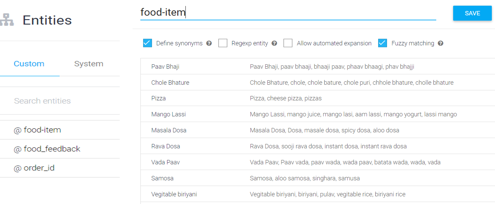
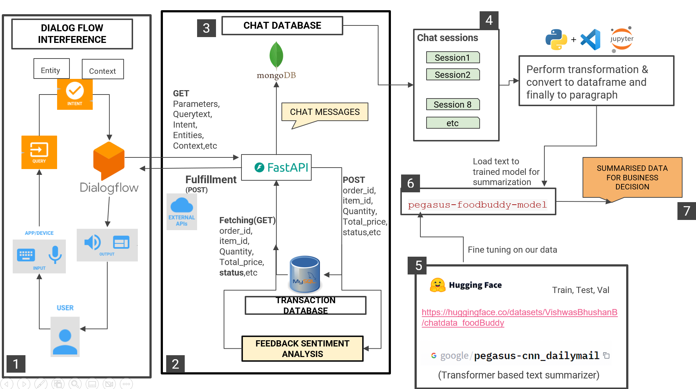
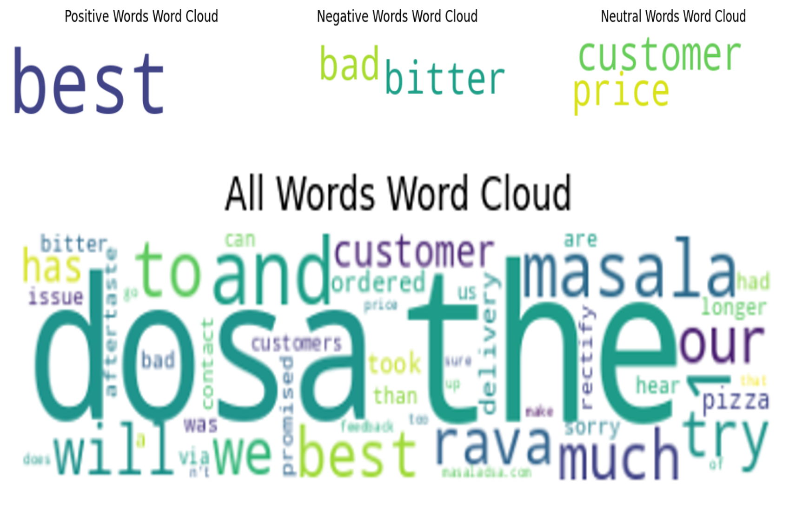

# Enhanced Restaurant Experience: NLP-powered Chatbot and Text Summarization with Dialogflow 
<div align="center">
    <a></a>
</div>

## Table of Contents

- [Restaurant-Based Chatbot And Text Summarization Using Dialog Flow](#Restaurant-Based-Chatbot-And-Text-Summarization-Using-Dialog-Flow)
  - [Table of Contents](#table-of-contents)
  - [Introduction](#introduction)
      - [Project Description](#project-description)
      - [Website](#website-screenshots)
  - [Dataset Preparation ](#dataset-preparation)
      - [Intent Images](#intent-images)
      - [Entities Images](#entities-images)
  - [Method](#method)
  - [Implementation](#implementation)
  - [Results](#results)
  - [Technical Information](#technical-information)
  - [Benefits](#benefits)
  - [Applications](#applications)
  - [Citations](#citations)
   
## Introduction

### Project Description

This project introduces a Restaurant Bot, a proof-of-concept powered by Dialog Flow. With advanced natural language processing capabilities, it allows users to effortlessly place food orders, track their status, assist customers by answering FAQs, make table reservations, provide menu details, and accommodate special requests. 

The project is divided into two main parts:
- **Part 1:** Create a restaurant bot using Dialog Flow.
- **Part 2:** Generate text summarization from the bot and user. This summary is then used to conduct sentiment analysis, helping the restaurant owner enhance customer satisfaction and drive business growth.

### Website Screenshots

<figure align="center"> 
  
  <figcaption>Food Delivery Website</figcaption>
</figure>


<figure align="center"> 
  
  <figcaption>ChatBot User Interface</figcaption>
</figure>

## Dataset Preparation:
**1. Teaching the Chatbot Our Language:** We define user goals (intents) like "View Menu" and provide examples of how users might ask for them. The variety and quality of these examples directly impact the chatbot's understanding.

**2. Extracting Key Details:** We identify important information users might provide (entities) like "number of guests" or "reservation time." Defining entities helps the chatbot pinpoint these details within user queries.

**3. Connecting the Chatbot to the Back-End (Fulfillment):** For dynamic responses or actions (e.g., checking availability), we'll use APIs (built with FASTAPI) to connect the chatbot to our systems, allowing it to retrieve information or complete tasks based on user interactions

### Intent Images:
<figure align="center"> 
  
  <figcaption>Generated Intents</figcaption>
</figure>

### Entities Images:
<figure align="center"> 
  
  <figcaption>Entities</figcaption>
</figure>

## Method:

<figure align="center"> 
  
  <figcaption>System Architecture of the project</figcaption>
</figure>


### **Module Descriptions:**
- **User Interface (UI) Module**: The UI module is responsible for crafting and showcasing the chatbot interface to end-users, incorporating features for user input, displaying chatbot responses, and presenting interactive options.
- **User Query Processing with Dialogflow**: This initial step concentrates on grasping your unique needs and optimizing the chatbot’s utility for your establishment.
- **Dialogflow Integration Module**: This module integrates the Dialogflow platform into the chatbot system, facilitating natural language understanding and seamless conversation flow.
- **Dialogflow Fulfillment Module**: The heart of our system is Dialogflow, which connects to external services like reservation databases to fulfill your requests by understanding your intent and extracting key information.  In essence, it lets the chatbot "talk" to other systems.
- **MySQL Database Module**: The Transaction Database for Order Management oversees the storage and retrieval of restaurant-related data, encompassing
menu items, orders, and reservations.
- **MongoDB Database Module**: This database houses chat sessions and transactional data linked to unique session IDs, ensuring seamless association of messages with their respective conversations for effortless retrieval and analysis.
- **FastAPI Backend Module**:The FastAPI backend module processes webhook requests from Dialogflow, executes business logic, and interfaces with the MySQL database.
- **Data Transformation Module**: Jupyter Notebooks are crucial for data transformation,  consolidating and structuring data (like chat messages from MongoDB) for analysis or summarization tasks.
- **Text Summarization with the Continuously Trained Pegasus Model**: Our system leverages the Pegasus model (both pre-trained and fine-tuned versions from Hugging Face) to summarize chat sessions.
- **Testing, Validation, and Deployment**: This involves conducting unit tests on individual components and executing end-to-end tests to simulate user interactions. Deployment encompasses the process of launching the chatbot system and hosting it on a selected platform to guarantee accessibility and security.

## Implementation:
Create an folder named chatbot (any name you like) then navigate to that folder using anaconda prompt and create environment
```bash
conda create --name chatbot python

conda create --name chatbot python=3.8   (can specify the python version if required)
```
Activate the environment
```bash
conda activate chatbot
```

To Run the File while developing
1.Run below command to start FastAPI
```bash
uvicorn main:app --reload
```
2.Download the ngrok.exe from ngrok page or go to https://dashboard.ngrok.com/get-started/setup/windows this setup page and follow steps for download as per your os/programming requirements
```bash
choco install ngrok
ngrok config add-authtoken 2eeSxTGVimejOxtIM4hUBusdDnd_75rZxYpbn5F3eGuG6cqXm
```
3.Run below command to start the server
```bash
ngrok http http://localhost:8000  or ngrok http 8000  (in cmd prompt)
```
4.Copy the url provided by server and paste it in fullfillment webhook URL of Dialogflow
```bash
https://69a4-2607-fb91-309b-5ed-1d1a-be1d-3d37-c09b.ngrok-free.app  (example)
```

## Results:
Fine-tuning the Pegasus model significantly improved its ability to summarize chat conversations (ROUGE-Lsum: 0.291 vs 0.199 baseline), enabling sentiment analysis for valuable customer insights and improved restaurant operations.  These findings confirm the chatbot's exceptional accuracy in understanding customer inquiries through NLP techniques.
<figure align="center"> 
  
  <figcaption>Sentiment Review Word Cloud (Positive/Negative/Neutral)</figcaption>
</figure>

## Demo:


## Technical Information:

- **Programming Language**: Python.
- **Cloud Service**: Google Dialog Flow.
- **Website scripting languages**: HTML , CSS, Javascript.
- **API framework**: Fast API.
- **Coding Environment**: VS Code.
- **Database**: Mysql for restaurant data, MongoDB for Chat data.


## Benefits:

- **Empowered Customers**: Chatbots can answer questions, generate reports, and offer personalized recommendations based on customer needs.
- **Data-Driven Insights**: Summarized reports on customer interactions to identify product demand and common pain points.
- **Enhanced Convenience**: Provides a faster and more user-friendly approach for everyone.

## Applications:

- **Sales Projections**: Utilize a chatbot to assess sales projections for the upcoming quarter, compare them against the budget, and pinpoint areas for improvement.
- **Summarized Reports**: Summarized reports reveal frequently asked questions, highlighting areas for product development or improved communication.
- **Customer Sentiments**: Sentiment analysis combined with slow resolution times can indicate frustrated customers, prompting a focus on faster issue resolution.

## Citations:
1. [Chatbot For A Restaurant Using DialogFlow](https://www.collegesidekick.com/study-docs/7263821)
2. [Title Image](https://www.upwork.com/services/product/development-it-a-bot-development-for-various-platforms-1693603859441704960)


